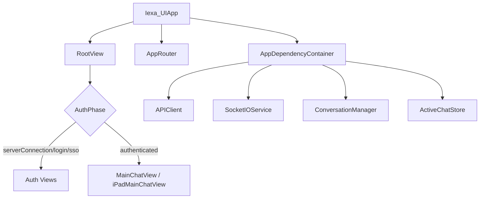
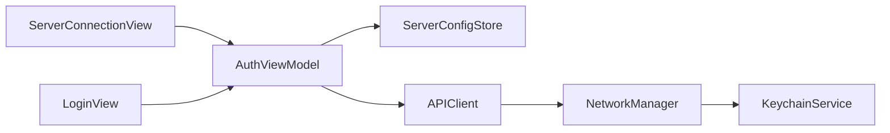
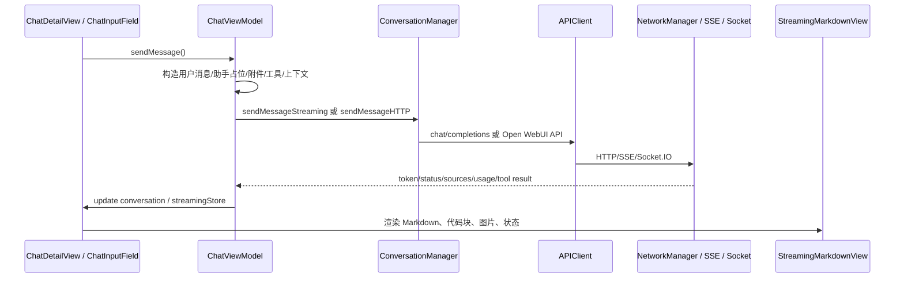
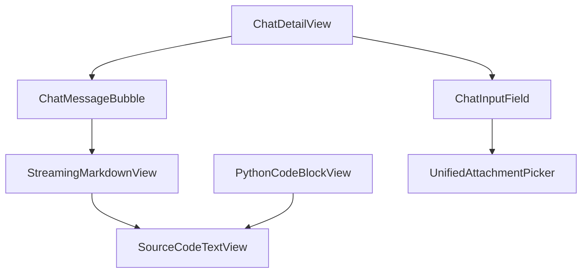
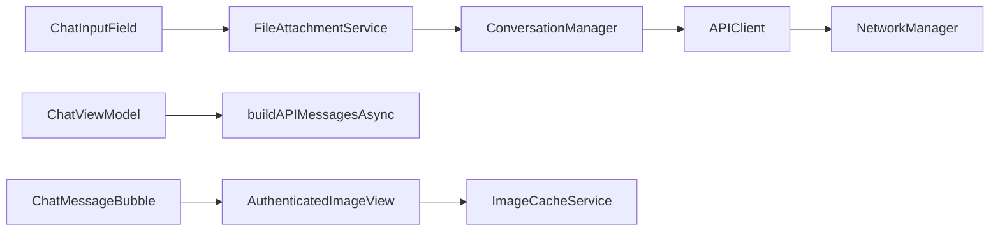
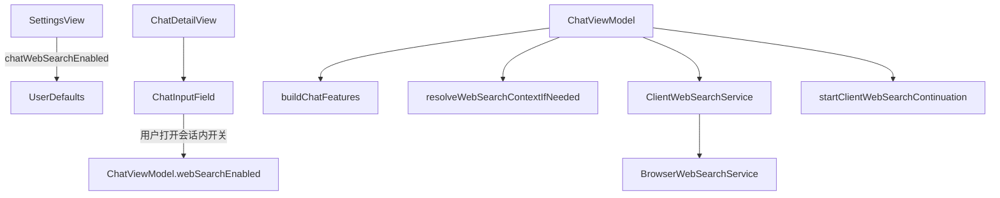
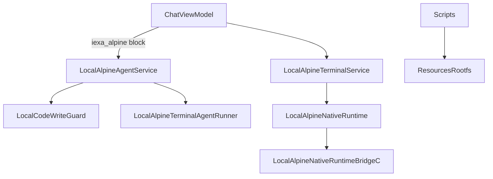
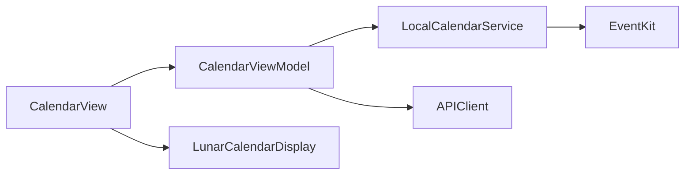
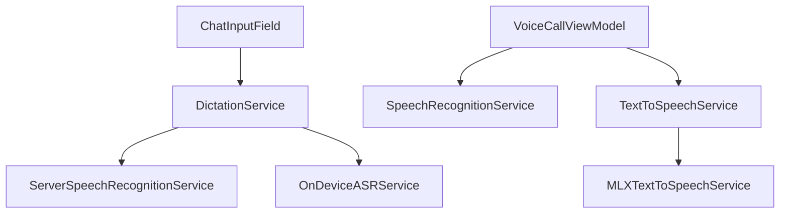
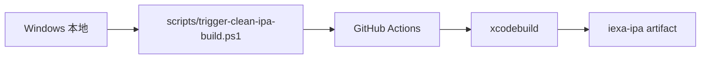

# Iexa iOS Code Map

这份地图用于以后快速改项目。先看“按需求找入口”，再按对应链路进入具体文件。项目主体是 SwiftUI iOS App，目录名仍保留为 `Iexa UI`，本地 Markdown 包在 `MarkdownView`，GitHub Actions 负责无证书/有证书 IPA 构建。

## 1. 总览

```text
Iexa-main-latest/
├─ Iexa UI/                         iOS App 主工程源码
│  ├─ App/                          App 启动、RootView、深链、生命周期
│  ├─ Navigation/                   全局路由
│  ├─ Core/
│  │  ├─ Models/                    Conversation、ChatMessage、AIModel 等数据模型
│  │  ├─ Networking/                APIClient、NetworkManager、SSE、Socket.IO
│  │  ├─ Services/                  业务服务、缓存、本地 Alpine、语音、日历
│  │  └─ Extensions/                日期、时间戳、emoji 等扩展
│  ├─ Features/                     业务页面和 ViewModel
│  │  ├─ Chat/                      聊天主界面、发送/流式/工具链路
│  │  ├─ Settings/                  设置页、聊天行为、TTS/STT、通知
│  │  ├─ Calendar/                  日历 UI、EventKit/后端日程数据
│  │  ├─ Auth/                      登录、服务器连接、账号切换
│  │  ├─ Admin/                     后台管理配置
│  │  ├─ Workspace/                 模型、工具、知识库、Prompt、Skill 管理
│  │  ├─ Channels/                  频道/群聊
│  │  ├─ Notes/                     笔记
│  │  ├─ VoiceCall/                 语音通话
│  │  ├─ Terminal/                  终端浏览
│  │  └─ Automations/Archive/...    自动化、归档、共享聊天
│  ├─ Shared/
│  │  ├─ Components/                跨页面 UI 组件
│  │  └─ Theme/                     主题、颜色、字体、动画
│  └─ Resources/                    内置资源，如 Alpine rootfs
├─ IexaUIWidgets/                   Widget / Live Activity 扩展
├─ MarkdownView/                    本地 Swift Package：Markdown 渲染器
├─ scripts/                         CI、本地 Alpine rootfs/iSH 准备脚本
├─ .github/workflows/               GitHub Actions IPA 构建
└─ artifacts/                       本地/下载产物目录
```

## 2. 启动与全局依赖



关键文件：

| 文件 | 作用 | 常改场景 |
| --- | --- | --- |
| `Iexa UI/App/Iexa_UIApp.swift` | App 入口、RootView、生命周期、深链、Quick Action、文件导入 | 启动白屏、登录后跳转、后台崩溃、外部文件打开、Widget 跳转 |
| `Iexa UI/Core/Services/DependencyContainer.swift` | 创建并持有 API、Socket、ConversationManager、语音、附件等服务 | 换服务器后状态异常、全局服务初始化、缓存清理 |
| `Iexa UI/Navigation/AppRouter.swift` | NavigationStack 路由、sheet、语音通话浮窗状态 | 页面跳转、弹窗、语音通话最小化 |
| `Iexa UI/Navigation/Route.swift` | 路由枚举 | 新增页面入口 |

全局原则：

- `AppDependencyContainer` 是主依赖入口，页面通过 `@Environment(AppDependencyContainer.self)` 拿服务。
- `ActiveChatStore` 缓存 `ChatViewModel`，避免切换聊天时流式任务丢失。
- 登录态由 `AuthViewModel.phase` 决定，`RootView` 根据 phase 切换 UI。
- 切服务器会重建 `APIClient`、`SocketIOService`、`ConversationManager`，也会清 Active Chat 缓存。

## 3. 登录、服务器与网络配置



关键文件：

| 文件 | 作用 | 常改场景 |
| --- | --- | --- |
| `Iexa UI/Features/Auth/ViewModels/AuthViewModel.swift` | 服务器连接、登录、注册、LDAP、SSO、Cloudflare/代理认证、账号切换 | 登录失败、登录后闪退、服务器识别、token 恢复 |
| `Iexa UI/Features/Auth/Views/*.swift` | 登录/服务器连接/SSO/代理挑战 UI | 登录页样式、输入项、错误提示 |
| `Iexa UI/Core/Models/ServerConfig.swift` | 服务器类型、URL、Headers、自签证书、Provider 类型 | 第三方站点兼容、OpenAI/Gemini/Anthropic 路径 |
| `Iexa UI/Core/Services/ServerConfigStore.swift` | 保存服务器、多账号、active server | 多账号切换、服务器列表、迁移 |
| `Iexa UI/Core/Networking/NetworkManager.swift` | 统一 URLSession 请求、headers、错误解析、上传、流式字节 | 所有 HTTP 通用问题、证书、Cloudflare headers |
| `Iexa UI/Core/Networking/APIClient.swift` | 后端 API 大集合 | 新接口、模型列表、聊天、图片/视频、管理员、日历、终端 |

改登录问题优先看：

1. `AuthViewModel.connect()`：服务器探测和 Provider 判断。
2. `AuthViewModel.login()/restoreSession()`：登录与恢复。
3. `AppDependencyContainer.configureServicesForActiveServer()`：登录后服务重建。
4. `RootView.authenticatedContent`：认证后进入主界面。

## 4. 聊天主链路



核心文件：

| 文件 | 作用 | 常改场景 |
| --- | --- | --- |
| `Iexa UI/Features/Chat/ViewModels/ChatViewModel.swift` | 聊天大脑：发送、流式、Socket、附件上下文、工具、联网搜索、本地 Alpine、续跑、标题/usage 等 | 绝大多数聊天行为问题 |
| `Iexa UI/Features/Chat/Views/ChatDetailView.swift` | 聊天详情页面：消息列表、输入框、附件 sheet、菜单、复制、Action 输入弹窗 | UI 展示、输入栏、消息操作、局部复制 |
| `Iexa UI/Features/Chat/Views/MainChatView.swift` | 手机主聊天布局、抽屉、会话列表和详情切换 | 首页布局、抽屉、创建新聊天 |
| `Iexa UI/Features/Chat/Views/iPadMainChatView.swift` | iPad 双栏布局 | iPad 布局 |
| `Iexa UI/Features/Chat/ViewModels/ChatListViewModel.swift` | 会话列表加载、搜索、删除、置顶 | 聊天列表问题 |
| `Iexa UI/Core/Services/ConversationManager.swift` | 对 `APIClient` 的聊天业务封装，也含本地会话 fallback store | 拉取/保存会话、上传文件、发送消息 |
| `Iexa UI/Core/Models/Conversation.swift` | Conversation、ChatTask、树形历史派生 | 消息树、版本、任务列表 |
| `Iexa UI/Core/Models/ChatMessage.swift` | ChatMessage、status、sources、files、metadata、error | 消息字段、来源、附件、错误展示 |

`ChatViewModel.swift` 里最常定位的区域：

| 位置/函数 | 作用 |
| --- | --- |
| `sendMessage()` | 新消息发送主入口，处理用户消息、附件、模型、工具、流式任务 |
| `buildChatFeatures()` | 把联网搜索、图片生成、代码解释器等开关转成请求 features |
| `buildAPIMessagesAsync()` | 构造发给模型的 messages，包括系统提示、上下文、附件、工具说明 |
| `resolveWebLinkContextIfNeeded()` | 普通链接/抖音等网页上下文解析 |
| `resolveWebSearchContextIfNeeded()` | 客户端联网搜索上下文解析 |
| `scheduleClientWebSearchToolIfNeeded()` | 模型请求客户端搜索时触发搜索工具 |
| `executeClientWebSearchTool()` | 执行搜索并把结果作为系统消息塞回会话 |
| `startClientWebSearchContinuation()` | 搜索结果回来后让模型继续回答 |
| `scheduleLocalWorkspaceAgentIfNeeded()` | 旧本地工作区 agent 调度 |
| `scheduleLocalAlpineAgentIfNeeded()` | Local Alpine agent 调度 |
| `executeLocalAlpineAgent()` | 真正执行 Alpine 工具块 |
| `scheduleLocalAlpineContinuationIfNeeded()` | Alpine 执行后自动续跑 |
| `appendLocalAlpineContinuationInstruction()` | 续跑提示词 |
| `updateAssistantMessage()` | 更新助手消息内容/状态/错误 |
| `cleanupStreaming()` | 流式结束清理 |
| `regenerateResponse()` | 重试/重新生成 |
| `startPassiveSocketListener()` | 被动监听外部网页/其他端发起的同 chat 流式事件 |

## 5. 聊天 UI 与 Markdown/代码块显示



关键文件：

| 文件 | 作用 | 常改场景 |
| --- | --- | --- |
| `Iexa UI/Shared/Components/ChatMessageBubble.swift` | 单条消息气泡容器 | 消息气泡样式 |
| `Iexa UI/Shared/Components/StreamingMarkdownView.swift` | Markdown 解析和渲染、代码块、图片/HTML/SVG/表格等展示 | 代码块缩进、复制、Markdown 乱渲染、图片展示 |
| `Iexa UI/Shared/Components/PythonCodeBlockView.swift` | Python 代码块专用入口，现在复用原样代码视图 | Python 缩进/复制/展示 |
| `Iexa UI/Shared/Components/ChatInputField.swift` | 输入框、工具按钮、附件预览、语音按钮、发送按钮 | 输入栏、开关、附件、语音入口 |
| `Iexa UI/Shared/Components/ToolsMenuSheet.swift` | 工具菜单 sheet | 工具选择 UI |
| `Iexa UI/Shared/Components/ModelSelectorSheet.swift` / `ModelPickerView.swift` | 模型选择 | 模型 picker |
| `Iexa UI/Shared/Components/UsageInfoPopover.swift` | token/上下文用量弹窗 | 用量显示 |

改代码块缩进/复制优先看：

1. `StreamingMarkdownView.SourceCodeTextView`：原样显示代码、复制原始文本。
2. `StreamingMarkdownView` 的 fenced code 分支：决定哪个语言走哪个组件。
3. `PythonCodeBlockView`：Python 专用视图入口。
4. 不要在 UI 层做自动缩进修复；写文件链路必须保留模型给出的原始源码。

## 6. 附件、图片、文件上传



关键文件：

| 文件 | 作用 | 常改场景 |
| --- | --- | --- |
| `Iexa UI/Core/Services/FileAttachmentService.swift` | PhotosPicker/File URL 处理、图片压缩、上传、附件状态 | 图片/文件发送失败、上传卡住、文件大小 |
| `Iexa UI/Shared/Components/UnifiedAttachmentPicker.swift` | 附件选择 UI | 相册/文件入口 |
| `Iexa UI/Shared/Components/AuthenticatedImageView.swift` | 需要鉴权的图片显示 | 后端图片显示失败 |
| `Iexa UI/Core/Services/ImageCacheService.swift` | 图片缓存、鉴权 headers、自签证书、favicon | 图片缓存、头像/生成图显示 |
| `Iexa UI/Core/Networking/SSEStream.swift` | 从 SSE 中提取图片引用/usage/content | 生成图流式解析 |
| `Iexa UI/Core/Networking/APIClient.swift` | `generateImage`、`editImage`、`generateVideo`、文件上传接口 | 图片/视频生成、provider 兼容 |

改图片生成或编辑：

- Chat 路由：`ChatViewModel.sendMessage()` 和图片 intent 判断。
- API 路由：`APIClient.generateImage()`、`editImage()`、`generateVideo()`。
- 显示：`SSEStream` 解析图片引用，`AuthenticatedImageView` / `ImageCacheService` 渲染。

## 7. 联网搜索链路



关键文件：

| 文件 | 作用 | 常改场景 |
| --- | --- | --- |
| `Iexa UI/Features/Settings/Views/SettingsView.swift` | 聊天行为设置，包含联网搜索总开关 | 用户级开关、默认行为 |
| `Iexa UI/Features/Chat/Views/ChatDetailView.swift` | 把设置态传给输入栏和会话 UI | 开关是否显示/可用 |
| `Iexa UI/Shared/Components/ChatInputField.swift` | 会话内联网搜索按钮 | 按钮样式、禁用态 |
| `Iexa UI/Features/Chat/ViewModels/ChatViewModel.swift` | 开关权限、搜索上下文、工具调用、续答 | 搜索触发、结果注入、只有开关打开才能用 |
| `Iexa UI/Core/Services/ClientWebSearchService.swift` | 客户端搜索服务入口 | 搜索请求格式 |
| `Iexa UI/Core/Services/BrowserWebSearchService.swift` | 浏览器/搜索页抓取实现 | 搜索结果质量、解析 |
| `Iexa UI/Core/Networking/WebSearchConfig.swift` | 搜索配置模型 | 搜索参数 |

注意：

- 总开关默认走 `UserDefaults` 的 `chatWebSearchEnabled`。
- 会话内 `webSearchEnabled` 还要受总开关限制。
- 不要再用“关键词猜测”偷偷触发搜索；显式打开才让搜索链路工作。

## 8. Local Alpine、本地执行与写文件链路



关键文件：

| 文件 | 作用 | 常改场景 |
| --- | --- | --- |
| `Iexa UI/Core/Services/LocalAlpineAgentService.swift` | 解析/执行 `iexa_alpine`，写文件、执行命令、结果 metadata | AI 写文件缩进错、执行链路、工具协议 |
| `Iexa UI/Core/Services/LocalCodeWriteGuard.swift` | 判断代码文件语言、写入安全策略 | 哪些文件算代码、写入规则 |
| `Iexa UI/Core/Services/LocalAlpineTerminalService.swift` | Alpine 终端命令执行、交互输入、状态 | 命令运行、stdin 小窗口、超时 |
| `Iexa UI/Core/Services/LocalAlpineTerminalAgentRunner.swift` | agent 工具块运行器 | 工具块调度格式 |
| `Iexa UI/Core/Services/LocalAlpineNativeRuntime.swift` | Swift 到本地 iSH runtime 封装 | 本地运行时、rootfs、挂载 |
| `Iexa UI/Core/Services/LocalAlpineNativeRuntimeBridge.c` | C bridge | native runtime 编译/链接 |
| `Iexa UI/Core/Services/LocalAlpineNativeRuntimeABI.h` | ABI 头文件 | Swift/C 接口 |
| `Iexa UI/Features/Terminal/Views/LocalWorkspaceFileBrowserView.swift` | 本地 Alpine 工作区/rootfs 浏览、预览、分享、删除、rootfs 重置 | 文件浏览、rootfs 管理 |
| `Iexa UI/Resources/iexa-alpine-rootfs.tar.gz` | 内置 Alpine rootfs | rootfs 更新 |
| `scripts/prepare-local-alpine-rootfs.*` | 准备 rootfs | 构建资源 |
| `scripts/prepare-ish-source.*` | 准备 iSH source | CI 本地 Alpine runtime |
| `scripts/build-local-alpine-ish-ci.sh` | CI 编译 iSH runtime | IPA 构建失败 |
| `scripts/enable-local-alpine-ish-ci.sh` | 修改 Xcode project 接入 runtime | 链接本地 runtime |

写文件链路重点：

- Python 和多数代码文件不要通过 shell heredoc/`echo > file` 直接写。
- 代码写入应走结构化字段：`code_lines`、`content_lines`、`content_base64`、`code_block`。
- `LocalAlpineAgentService` 会拦截易破坏缩进的纯文本写入方式。
- `.py/.pyw` 现在要求来源足够结构化，避免模型输出在 shell 字符串里被二次转义或丢缩进。
- 全屏 Local Alpine 终端的 cwd 是真实 Alpine 路径；`/mnt/iexa` 是共享工作区，`/`、`/root`、`/tmp` 属于 rootfs。
- rootfs 浏览器可以重置 writable rootfs；已经启动 iSH runtime 时会延迟到下次 App 启动生效，避免删除已挂载文件系统。

如果“AI 落盘文件缩进错”：

1. 先看 `LocalAlpineAgentService` 的写文件解析。
2. 再看 `LocalCodeWriteGuard` 识别语言是否正确。
3. 再看 `ChatViewModel` 的 Local Alpine prompt 是否要求结构化写入。
4. 最后看 UI 代码块是否原样复制，位置是 `SourceCodeTextView`。

## 9. 本地工作区 Agent 与本地 iOS 工具

| 文件 | 作用 | 常改场景 |
| --- | --- | --- |
| `Iexa UI/Core/Services/LocalWorkspaceAgentService.swift` | 旧本地工作区工具块 `iexa_workspace` | 旧工作区路径兼容 |
| `Iexa UI/Core/Services/LocalNativeToolService.swift` | 本地 iOS 原生工具块 | iOS 原生能力工具 |
| `Iexa UI/Features/Chat/ViewModels/ChatViewModel.swift` | 调度 workspace/alpine/native 工具 | 工具调用是否自动续跑 |

当前推荐：

- Local Alpine 是主要本地执行路径。
- Workspace agent 主要用于旧兼容，避免新功能再往旧路径堆。
- 如果用户是在本地 Alpine 模式下问项目文件/执行任务，应走 Local Alpine，不要回退到服务端或关键词猜测。

## 10. 日历链路



关键文件：

| 文件 | 作用 | 常改场景 |
| --- | --- | --- |
| `Iexa UI/Features/Calendar/Views/CalendarView.swift` | 日历 UI：年/月/周/日视图、UICalendarView bridge、农历显示 | 日历外观、农历、日期选择、事件块 |
| `Iexa UI/Features/Calendar/ViewModels/CalendarViewModel.swift` | 加载 calendar/event、月份范围、增删事件 | 事件加载、创建/删除、视图切换 |
| `Iexa UI/Core/Models/CalendarModels.swift` | OWCalendar、CalendarEvent、CreateRequest | 字段解析、后端兼容 |
| `Iexa UI/Core/Services/LocalCalendarService.swift` | EventKit 本机日历权限和读写 | iOS 系统日历同步、权限 |
| `Iexa UI/Core/Networking/APIClient.swift` | `getCalendars/getCalendarEvents/createCalendarEvent/deleteCalendarEvent` | 后端日历 |

农历显示：

- UI 入口在 `CalendarView.swift` 的 `LunarCalendarDisplay`。
- 月/周/日视图如果要像 iOS 原生一样显示更多农历信息，优先在该 display helper 扩展。
- `UICalendarView` decoration 走 `makeLunarDecorationView`，列表/标题走 compact/full 文案。

## 11. 设置页

| 文件 | 作用 | 常改场景 |
| --- | --- | --- |
| `Iexa UI/Features/Settings/Views/SettingsView.swift` | 设置首页、聊天行为、默认模型、TTS/STT、通知、退出 | 聊天行为开关、默认模型、语音配置 |
| `Iexa UI/Features/Settings/Views/AppearanceSettingsView.swift` | 外观设置 | 主题、暗色、字体 |
| `Iexa UI/Features/Settings/Views/AccessibilitySettingsView.swift` | 可访问性 | 字体、动画、辅助功能 |
| `Iexa UI/Features/Settings/Views/ServerManagementView.swift` | 服务器管理 | 增删服务器 |
| `Iexa UI/Features/Settings/Views/ProfileView.swift` | 用户资料 | 头像、昵称 |
| `Iexa UI/Features/Settings/Views/MemoriesView.swift` | 记忆管理 | memory UI |
| `Iexa UI/Features/Settings/Views/LocalSkillsSettingsView.swift` | 本地 skills | 本地技能 |

聊天行为设置重点在 `ChatSettingsView`，通常通过 `@AppStorage` 写 UserDefaults，然后 `ChatViewModel` 或输入栏观察变化。

## 12. 模型、工具、知识库、Workspace

| 文件 | 作用 | 常改场景 |
| --- | --- | --- |
| `Iexa UI/Features/Workspace/Views/ModelListView.swift` / `ModelEditorView.swift` | 模型列表和编辑 | 模型参数、能力、头像、默认值 |
| `Iexa UI/Core/Services/ModelManager.swift` | 模型 API 封装 | 模型 CRUD |
| `Iexa UI/Core/Models/AIModel.swift` | 聊天模型基础结构、actions、capabilities | 模型能力判断 |
| `Iexa UI/Core/Models/WorkspaceModels.swift` | Prompt/Knowledge/Skill/Tool/Function/Model detail | Workspace 数据模型 |
| `Iexa UI/Core/Services/PromptManager.swift` | Prompt CRUD | Prompt 管理 |
| `Iexa UI/Core/Services/KnowledgeManager.swift` | 知识库 CRUD | 知识库 |
| `Iexa UI/Core/Services/SkillsManager.swift` | Skill CRUD | Skills |
| `Iexa UI/Core/Services/ToolsManager.swift` | Tool CRUD | Tools |
| `Iexa UI/Core/Services/FunctionsManager.swift` | Admin Functions CRUD | 函数工具 |

模型能力影响聊天：

- `ChatViewModel.resolveActionsForModel()` / `resolveFiltersForModel()` 会拉模型 action/filter。
- `ChatViewModel.applyIncrementalModelDefaults()` 一类逻辑会把模型默认工具同步到 UI。
- `APIModels.ChatCompletionRequest` 决定请求 JSON 如何面向 Open WebUI/OpenAI/Anthropic 兼容。

## 13. 管理后台

| 目录/文件 | 作用 |
| --- | --- |
| `Iexa UI/Features/Admin/Views/AdminConsoleView.swift` | 管理后台主入口 |
| `Iexa UI/Features/Admin/ViewModels/AdminViewModel.swift` | 管理后台主 VM |
| `AdminGeneralSettingsViewModel.swift` | 通用设置 |
| `AdminConnectionsViewModel.swift` | 连接配置 |
| `AdminImagesViewModel.swift` | 图片模型/图片配置 |
| `AdminAudioViewModel.swift` | 音频配置 |
| `AdminGroupsViewModel.swift` | 分组/权限 |
| `AdminCodeExecutionViewModel.swift` | 代码执行配置 |
| `AdminWebSearchViewModel.swift` | 后台联网搜索配置 |
| `APIClient.swift` admin 段 | 真实 API 调用 |

改后台页面先看对应 ViewModel，再看 `APIClient` 里同名接口。

## 14. 语音、听写、TTS/STT



关键文件：

| 文件 | 作用 | 常改场景 |
| --- | --- | --- |
| `Iexa UI/Core/Services/DictationService.swift` | 输入框听写状态机，server/on-device 切换 | 说句话转半天、听写失败 |
| `Iexa UI/Core/Services/OnDeviceASRService.swift` | 本地 ASR 模型下载/加载/转写/后台暂停 | Qwen/Parakeet 下载、Processing 卡住 |
| `Iexa UI/Core/Services/ServerSpeechRecognitionService.swift` | 服务端 STT 上传 | 服务端听写 |
| `Iexa UI/Core/Services/SpeechRecognitionService.swift` | Apple Speech | 系统语音识别 |
| `Iexa UI/Core/Services/TextToSpeechService.swift` | TTS 总入口，system/server/kokoro | 朗读、流式朗读、声音选择 |
| `Iexa UI/Core/Services/MLXTextToSpeechService.swift` | Kokoro/MLX TTS | 本地 TTS 模型 |
| `Iexa UI/Features/VoiceCall/ViewModels/VoiceCallViewModel.swift` | 语音通话逻辑 | 语音通话 |
| `Iexa UI/Features/VoiceCall/Views/*.swift` | 通话 UI 和悬浮 pill | 通话界面 |

后台安全点：

- `Iexa_UIApp` 在进入后台时会停止/卸载 MLX 相关模型，避免 iOS 后台 GPU 崩溃。
- ASR 卡住时同时查 `DictationService.state` 和 `OnDeviceASRService.state`。

## 15. Notes、Channels、Automations、Archive

| 功能 | 入口文件 | 服务/模型 |
| --- | --- | --- |
| Notes | `Features/Notes/Views/NotesListView.swift`, `NoteEditorView.swift` | `NotesListViewModel.swift`, `NotesManager.swift`, `Note.swift` |
| Channels | `Features/Channels/Views/ChannelsListView.swift`, `ChannelDetailView.swift` | `ChannelListViewModel.swift`, `ChannelViewModel.swift`, `Channel.swift`, `ChannelMessage.swift` |
| Automations | `Features/Automations/Views/*.swift` | `AutomationsViewModel.swift`, `Automation.swift`, `APIClient` automation 段 |
| Archive | `Features/Archive/Views/*.swift` | `ArchivedChatsViewModel.swift`, `ConversationManager` |
| Shared chats | `Features/SharedChats/Views/*.swift` | `SharedChatsViewModel.swift`, `APIClient` shared 段 |

## 16. 主题与通用组件

| 文件 | 作用 |
| --- | --- |
| `Iexa UI/Shared/Theme/AppTheme.swift` | 主题入口 |
| `ColorTokens.swift` | 颜色 token |
| `Typography.swift` | 字体 |
| `DesignTokens.swift` | 间距、圆角等 |
| `Animations.swift` | 动画 |
| `ViewStyles.swift` | 通用 View modifier |
| `SettingsComponents.swift` | 设置页复用组件 |
| `EmptyStates.swift` / `LoadingStates.swift` / `ErrorRecovery.swift` | 通用状态 UI |

视觉修改优先找 `Shared/Theme`，不要在单个页面重复硬编码大量颜色。

## 17. MarkdownView 本地包

`MarkdownView/` 是本地 Swift Package，不是普通 App 源码目录。

| 目录 | 作用 |
| --- | --- |
| `MarkdownView/Sources/MarkdownParser` | Markdown block/inline parser |
| `MarkdownView/Sources/MarkdownView/MarkdownTextBuilder` | 增量流式文本构建 |
| `MarkdownView/Sources/MarkdownView/MarkdownTextView` | UIKit 文本渲染 |
| `MarkdownView/Sources/MarkdownView/Components/CodeView` | 包内代码视图 |
| `MarkdownView/Tests` | Markdown 包测试 |

一般聊天里的代码块外观优先改 `Iexa UI/Shared/Components/StreamingMarkdownView.swift`，只有 parser 或底层 Markdown 包问题才改 `MarkdownView/`。

## 18. Widget / Live Activity

| 文件 | 作用 |
| --- | --- |
| `IexaUIWidgets/IexaUIWidgetsBundle.swift` | Widget bundle |
| `IexaUIWidgets/IexaUIWidgets.swift` | Widget 入口 |
| `IexaUIWidgets/IexaUIWidgetsLiveActivity.swift` | Live Activity |
| `IexaUIWidgets/IexaUIWidgetsControl.swift` | Control Center widget |
| `Iexa UI/Core/Services/SharedDataService.swift` | App 和 Widget 共享数据 |
| `Iexa UI/Core/Services/RunLiveActivityService.swift` | 聊天/本地 Alpine 运行 Live Activity |

CI 无证书 IPA 会去掉 extension 插件；有证书构建要给主 App 和 Widget 分别配 provisioning profile。

## 19. 构建与 IPA



关键文件：

| 文件 | 作用 |
| --- | --- |
| `scripts/trigger-clean-ipa-build.ps1` | Windows 触发 GitHub Actions IPA 构建的主脚本 |
| `.github/workflows/build-ios-ipa.yml` | IPA 构建 workflow |
| `scripts/prepare-local-alpine-rootfs.sh/.ps1` | 生成 Alpine rootfs |
| `scripts/prepare-ish-source.sh/.ps1` | 准备 iSH 源码 |
| `scripts/build-local-alpine-ish-ci.sh` | CI 编译 iSH |
| `scripts/enable-local-alpine-ish-ci.sh` | 修改 Xcode project，把 iSH runtime 链进 App |

常见构建定位：

- Swift 编译错：看 Actions `Build unsigned fallback app` 的 `error:` 行。
- 无证书 IPA：workflow input `unsigned_only=true`，产物名通常是 `iexa-ipa`，里面是 `Iexa-unsigned.ipa`。
- Local Alpine runtime 没链接：workflow 会检查二进制里是否还有 “not compiled with IEXA_LOCAL_ALPINE_ISH=1”。
- Widget 签名缺失：CI 会去掉 extension，避免 IPA 安装失败。

## 20. 按需求找入口

| 你要改的东西 | 先看这些文件 |
| --- | --- |
| 发送消息、停止、重试、流式输出 | `ChatViewModel.swift`, `ConversationManager.swift`, `APIClient.swift`, `SSEStream.swift`, `SocketIOService.swift` |
| 输入框、发送按钮、联网搜索按钮、附件按钮 | `ChatInputField.swift`, `ChatDetailView.swift` |
| 消息气泡、Markdown、代码块、复制 | `ChatMessageBubble.swift`, `StreamingMarkdownView.swift`, `PythonCodeBlockView.swift` |
| AI 写文件缩进、代码落盘、命令执行 | `LocalAlpineAgentService.swift`, `LocalCodeWriteGuard.swift`, `LocalAlpineTerminalService.swift`, `ChatViewModel.swift` |
| 本地 Alpine 小窗口输入 | `LocalAlpineTerminalService.swift`, `ChatDetailView.swift` 的 `ActionInputSheet`/`localAlpineInputRequest` |
| 联网搜索开关/触发/结果续答 | `SettingsView.swift`, `ChatDetailView.swift`, `ChatInputField.swift`, `ChatViewModel.swift`, `ClientWebSearchService.swift` |
| 图片/文件发送失败 | `FileAttachmentService.swift`, `ConversationManager.swift`, `APIClient.swift`, `AuthenticatedImageView.swift`, `ImageCacheService.swift` |
| 图片生成/图片编辑/视频生成 | `ChatViewModel.swift`, `APIClient.swift`, `SSEStream.swift`, `ImageCacheService.swift` |
| 日历和农历 | `CalendarView.swift`, `CalendarViewModel.swift`, `CalendarModels.swift`, `LocalCalendarService.swift` |
| 登录、服务器连接、第三方 Provider | `AuthViewModel.swift`, `ServerConfig.swift`, `ServerConfigStore.swift`, `APIClient.swift`, `NetworkManager.swift` |
| 模型列表/默认模型/模型能力 | `SettingsView.swift`, `AIModel.swift`, `ModelManager.swift`, `Workspace/Views/Model*`, `ChatViewModel.swift` |
| 管理后台设置 | `Features/Admin/ViewModels/*`, `Features/Admin/Views/*`, `APIClient.swift` |
| 语音输入/听写 | `DictationService.swift`, `OnDeviceASRService.swift`, `ServerSpeechRecognitionService.swift`, `ChatInputField.swift` |
| TTS/朗读 | `TextToSpeechService.swift`, `MLXTextToSpeechService.swift`, `SettingsView.swift` |
| Widget/Live Activity | `IexaUIWidgets/*`, `SharedDataService.swift`, `RunLiveActivityService.swift` |
| IPA 构建 | `scripts/trigger-clean-ipa-build.ps1`, `.github/workflows/build-ios-ipa.yml` |

## 21. 修改时的安全边界

1. 不要把 UI 展示问题和文件写入问题混在一起修。代码块显示在 `StreamingMarkdownView`，落盘写入在 `LocalAlpineAgentService`。
2. `ChatViewModel.swift` 很大，改之前先搜函数名，尽量只动对应链路。
3. 新增聊天功能时，要同时考虑：
   - UI 开关或入口；
   - `ChatViewModel` 状态；
   - 请求 `ChatCompletionRequest`；
   - 服务端/第三方 provider 兼容；
   - 流式/SSE/Socket 回写；
   - 消息持久化 metadata。
4. 第三方 OpenAI-compatible provider 不一定支持 Open WebUI 的所有端点，先看 `ServerConfig.ProviderType` 和 `APIClient` 对应兼容分支。
5. 有本地执行能力的功能不要靠关键词猜测自动执行，优先显式开关/工具块/用户确认。
6. 日历权限和系统日历写入要走 `LocalCalendarService`，不要直接在 View 里碰 EventKit。
7. 图片显示失败不要只查生成接口，也要查 `ImageCacheService` 的鉴权 headers、自签证书和 data URL 解析。
8. Windows 本地不能完整验证 iOS 编译，Swift 编译以 GitHub Actions 的 Xcode 日志为准。

## 22. 建议的排查命令

```powershell
# 快速列源码
rg --files -g "!build" -g "!DerivedData" -g "!.git" -g "!*.ipa" -g "!*.xcarchive"

# 找 Swift 类型入口
rg -n "^(struct|final class|class|actor|enum|protocol|extension) " "Iexa UI"

# 找聊天发送链路
rg -n "sendMessage|buildAPIMessagesAsync|buildChatFeatures|scheduleLocalAlpine|executeLocalAlpine|resolveWebSearch" "Iexa UI/Features/Chat/ViewModels/ChatViewModel.swift"

# 找 API 方法
rg -n "func .*async throws" "Iexa UI/Core/Networking/APIClient.swift"

# 本地静态 whitespace 检查
git diff --check

# 触发无证书 IPA 构建
powershell -ExecutionPolicy Bypass -File "scripts/trigger-clean-ipa-build.ps1"

# 看最近 GitHub Actions
gh run list --limit 5
gh run view <run-id> --log-failed
```

## 23. 维护这张地图

每次做比较大的结构性改动后，同步更新本文件：

- 新增功能目录：更新第 1 节和对应功能节。
- 改聊天主链路：更新第 4、5、7、8、20 节。
- 改构建脚本：更新第 19 节。
- 改模型/Provider/API：更新第 3、4、12 节。
- 改 Local Alpine：更新第 8、9、19 节。

这份文档不是 README，而是维修地图。目标是以后打开项目先用它定位，不用再全仓库盲搜。
